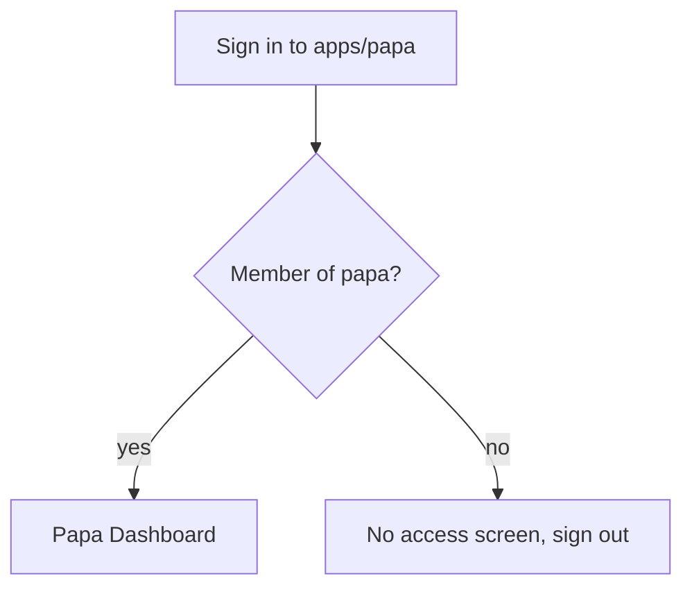
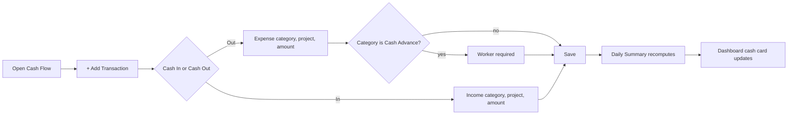
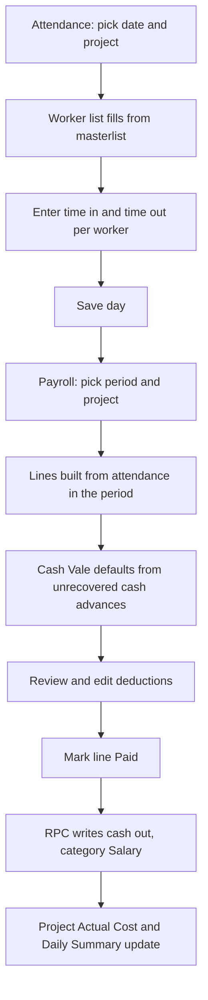
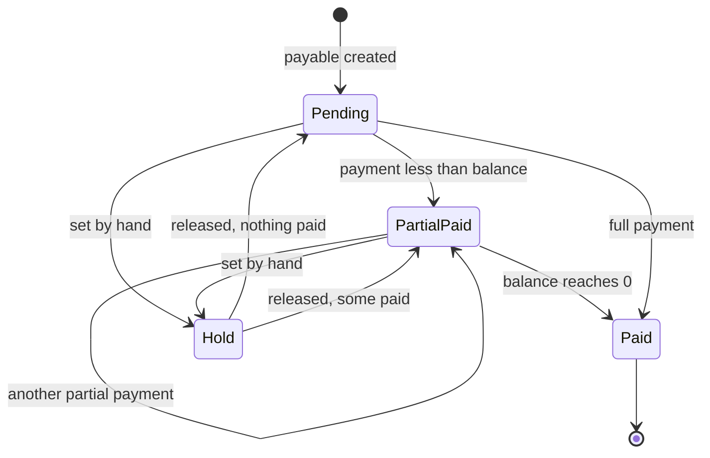
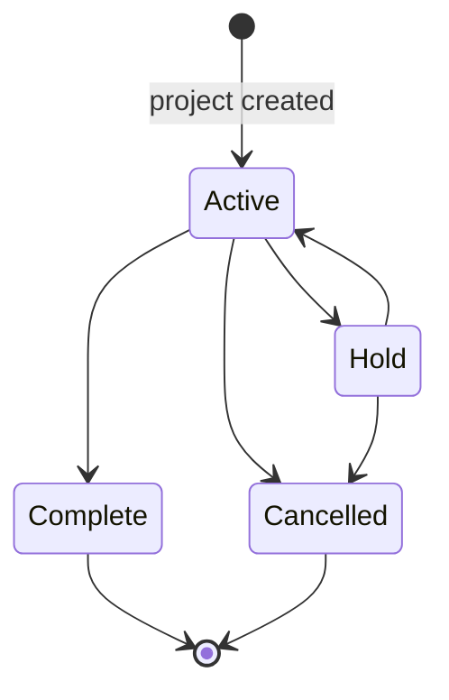
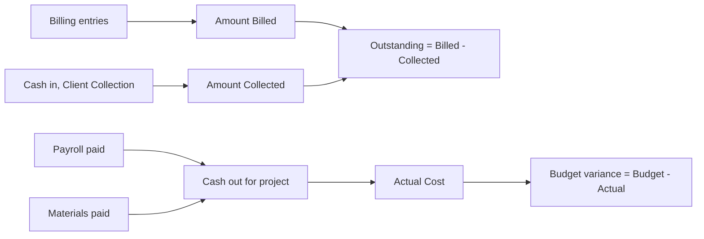

# Papa Tracker App Flows

## 1. Sign-in and workspace check

`apps/papa` and `apps/web` are separate deployments on the same Supabase project (D103). Each app
checks membership for its own workspace only.

The check is for the user's benefit. It is not the security boundary: RLS filters every query,
so an account without `papa` membership gets zero rows even if it bypasses the screen.

## 2. Daily bookkeeping loop

## 3. Attendance to payroll

## 4. Payable lifecycle

Each payment: amount, date, optional receipt. The RPC writes the payment row and a cash-out entry in
one transaction.

## 5. Project lifecycle

Project detail money flow:

## 6. Dashboard drill-down

| Card | Click opens |
|---|---|
| Projects count by status | Projects board filtered to that status |
| Daily Cash Flow Summary | Cash Flow on today |
| Payables due date row | Payables filtered to that payable |
| Debts creditor row | Payables filtered to that creditor |
